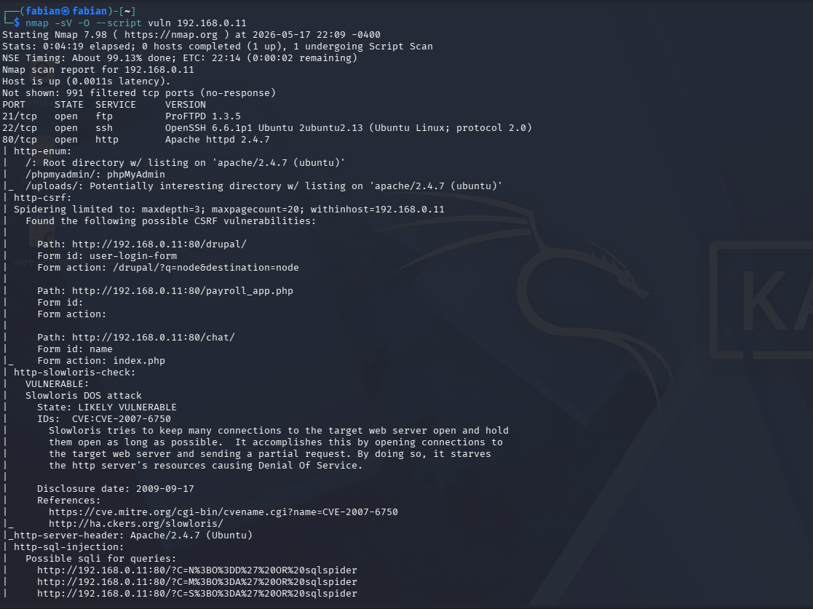

Lab 1. Practica de defensa activa

Gestión de Parches y Hardening (Habilidad: Implementar parches)
Entorno: Ubuntu Server desactualizado.
Actividad: Los alumnos reciben un informe de vulnerabilidades (simulado).
Tarea: 1. Identificar servicios vulnerables usando nmap --script vuln. 2. Aplicar parches específicos usando apt-get install --only-upgrade [paquete]. 3. Configurar Unattended Upgrades para automatizar parches críticos.

Entorno: Una VM Ubuntu Server "congelada" en una versión antigua o con servicios vulnerables (ej. un servicio de impresión o una versión de OpenSSH con vulnerabilidades conocidas).
Dinámica:
Escaneo Inicial: Desde Kali, usar nmap -sV --script vuln [IP_Ubuntu]. Los alumnos deben identificar al menos 3 vulnerabilidades con su código CVE correspondiente.

Investigación: Buscar en la base de datos del NVD (NIST) qué permite hacer ese CVE (ej. RCE o DoS).

Aplicación de Parche:
Simular la política de "parches críticos primero".
Uso de apt-get install --only-upgrade [servicio] para no romper dependencias globales.

Configuración de Seguridad Autónoma: Instalar unattended-upgrades.
sudo apt install unattended-upgrades
Configurar /etc/apt/apt.conf.d/50unattended-upgrades para que solo se instalen parches de "Security".
Habilidad ganada: Capacidad de priorizar la remediación basada en el impacto organizacional.

¿QUE SE VA HACER?

Se utilizara una maquina ubuntu server desactualizada con el objetivo de identificar las vulnerabilidades que esta presenta, para posteriormente realizar una remediacion aplicando parches de seguridad.

Tambien se investigaran al menos 3 CVE detectados en la maquina victima con la pagina nvd para poder verificar cuales son los peligros que este representa para el sistema.

LO QUE SE VERA

Se lograran observar multiples servicios y sus vulnerabilidades, tambien se podra observar un escaneo de vulnerabilidades por parte de la maquina atacante la cual es una kali linux, esta hara el escaneo con nmap, configuraciones para el proceso de remediacion en el sistema mediante aplicacion de parches o actualizaciones.

FINALIDAD

Aprender acerca de la importancia sobre como funciona el proceso de remediacion o fortalecimiento de un equipo para evitar posibles ataques inminentes, estas medidas son importantes para disminuir los riesgos de seguridad y mantener el equipo (ubuntu server) actualizado al dia.

HERRAMIENTAS

-Ubuntu server

-Kali Linux

-nmap

-nvd

DESARROLLO

Primero comenzamos haciendo un escaneo con la maquina atacante kali linux hacia la maquina victima desactualizada (ubuntu server) 

Como se puede ver en la imagen el escaneo contiene los parametros de -sV para detectar los servicios que estan corriendo en la maquina y sus versiones correspondientes -O para detectar el sistema operativo y un script vuln para detectar las vulnerabilidades conocidas en los servicios que fueron detectados.

Como se puede apreciar en la foto el escaneo fue un exito.

