Como adición al primer laboratorio se implementara cifrado a un fichero

¿QUE SE HARA?
Se creara un fichero con datos sensibles el cual luego será cifrado mediante gpg. Una vez cifrado se podrá ver que el archivo no puede ser leído y que para proceder a leerlo se deberá de descifrar el fichero mediante una contraseña que es colocada cuando el proceso de cifrado se llevo a cabo

¿QUE SE VERA?
-La creación y el cifrado de un fichero
-Como se cifra un fichero
-Que es lo que se ve al tratar de leer un fichero cifrado
-Como leer un  fichero que esta cifrado

FINALIDAD
Verificar la función de cifrado con la que cuenta ubuntu para darle una capa de protección a los archivos que pueden estar en un equipo para la protección de información sensible. Esto demuestra que el cifrado de archivo es muy importante ya que agrega una capa de seguridad a los archivos que creemos no solo impidiendo que un posible atacante lea los datos si obtiene el fichero sino que también impidiéndole el ingreso mediante una contraseña.

HERRAMIENTAS
Ubuntu server
gpg 

DESARROLLO
Primero se crea el fichero con nano
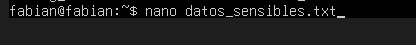

Luego se añaden los datos
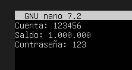

Con los datos ya ingresados se realiza el cifrado con gpg el cual es una herramienta de cifrado que viene por defecto en ubuntu server, esta herramienta realiza el cifrado mediante algoritmos criptograficos 
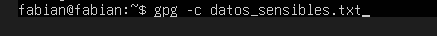

Luego de ingresar el comando para cifrar el fichero se nos pedira colocar una contraseña
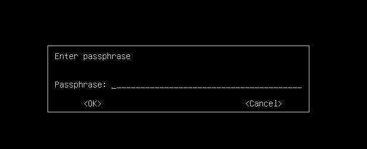

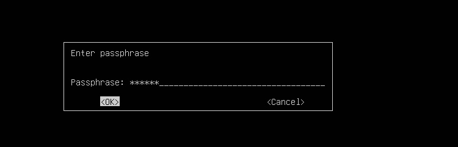

Mediante un ls se puede verificar que con el proceso de cifrado ya terminado al archivo que ciframos se le añade la extension .gpg
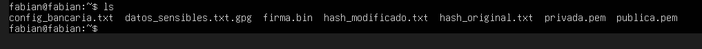

Para verificar si el cifrado fue exitoso se intenta ingresar a el y leerlo con el comando cat
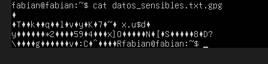

Como se puede ver los datos no pueden ser leidos solo se pueden visualizar binarios por lo tanto, los datos estan protegidos.

Para poder leer los datos se debe ingresar el siguiente comando

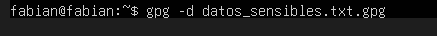

Con este comando ingresado se nos pedira la contraseña la cual definimos anteriormente

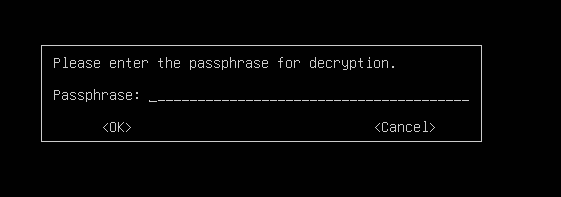

Cuando la contraseña es colocada con exito se pueden visualizar los datos correctamente

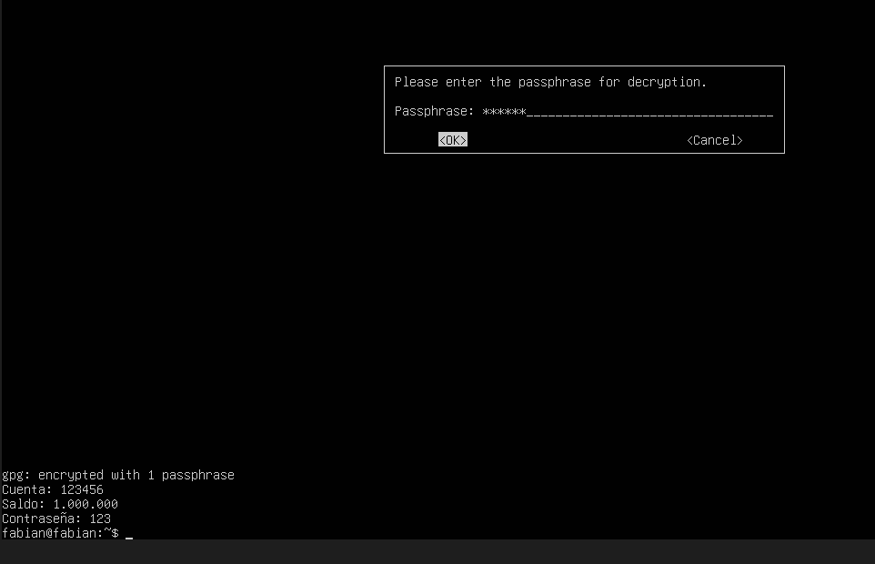

Cuando se ingresa una contraseña incorrecta el fichero no podra ser leido

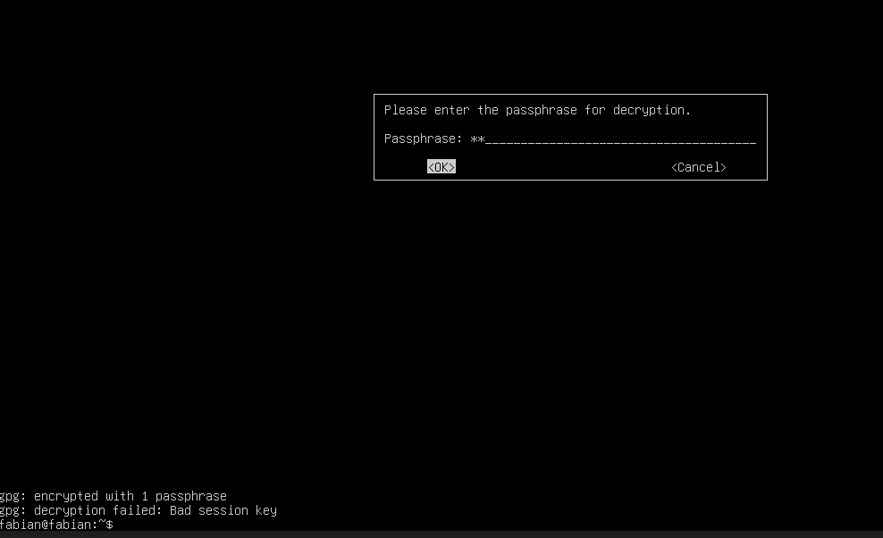
