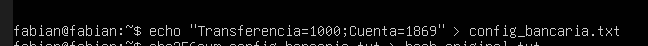
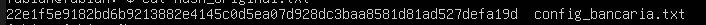

Laboratorios Prácticos (Entorno Kali / Ubuntu)

Entorno: Ubuntu Server (Víctima/Servidor) y Kali (Auditor).

Actividad: Configuración de firma digital y verificación de integridad.
Comandos clave: openssl, sha256sum, gpg.
Tarea: Los alumnos deben generar un par de llaves (Pública/Privada), firmar un archivo de configuración crítico y verificar que si se cambia un solo bit del archivo, el hash de integridad falla.
Enfoque organizacional: Simular la firma de un manifiesto de software antes de subirlo a producción.

Dinámica:
Generación de Hash crea un archivo config_bancaria.txt. Usa sha256sum para generar su huella digital.
Simulación de Ataque: Un "atacante" modifica un solo carácter (ej: cambia un 0 por un 1 en un monto).
Verificación: El alumno vuelve a correr el hash y nota que la "huella" es totalmente distinta.
Firma Digital (OpenSSL):
Generar llave privada: openssl genrsa -out privada.pem 2048
Generar llave pública: openssl rsa -in privada.pem -pubout -out publica.pem
Firmar archivo: openssl dgst -sha256 -sign privada.pem -out firma.bin config_bancaria.txt

¿QUE SE HARA?

Se creara un archivo que simula una cuenta bancaria este archivo será encriptado con sha256. Luego de esto se simulara un ataque dentro del archivo añadiendo un carácter luego de esto se volverá a encriptar el archivo modificado para ver si es que el hash sufre algun cambio.

También se realizara la creación llaves publicas y privadas y luego se firmara el archivo.

¿QUE SE VERA?

-Una vez el archivo sea modificado se podrá observar un cambio notable en el hash.

-También se podrá visualizar la creación de las llaves tanto publica como privada.

-Se podrá observar que un archivo el cual sea modificado no podrá pasar a la firma.

LA FINALIDAD DE ESTE LABORATORIO

Entender como funciona los mecanismos de encriptacion o criptograficos mediante el uso de sha256 el cual es una funcion criptografica, la finalidad tambien incluye obtener una comprension acerca de las firmas digitales tanto publica como privada, esto con el fin de garantizar que la informacion no ha sido alterada y si lo fue enterarse de forma inmediata.

Herramientas

-Ubuntu server
-sha256
-ssl

DESARROLLO DEL LABORATORIO

Primero se crea el archivo

Se realiza el hash

Se verifica el hash

Se crean las llaves

Se realiza la firma

Se verifica la firma y se puede ver que todo esta bien

Se simula el ataque cambiando un caracter

Se genera el hash al archivo modificado y se puede apreciar que el ahsh cambia

Se vuelve a verificar la firma detectando que la firma falla

