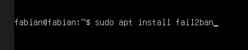
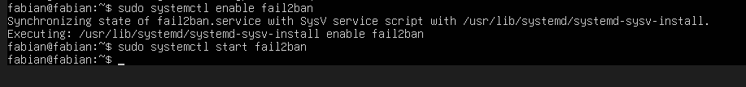
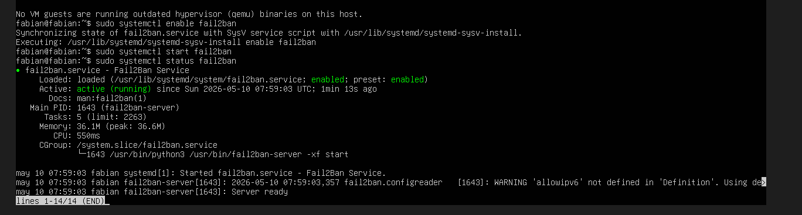
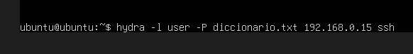
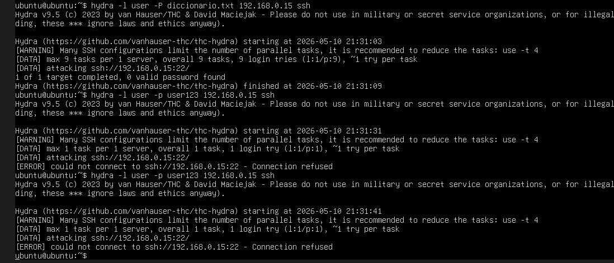
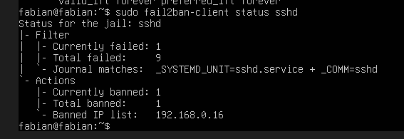

Como adición a este segundo laboratorio se aplicara e instalara la herramienta de fail2ban 

¿QUE SE HARA?
Se instalara la herramienta fail2ban en la maquina ubuntu server (victima) para poder así tener una capa de protección extra ante los ataques de fuerza bruta que sean realizados en el servidor ssh de la victima.

LO QUE SE VERA
-Instalación de fail2ban
-Ataque con hydra
-Bloqueo de ip de la maquina atacante con fail2ban

FINALIDAD
La finalidad de esto es lograr demostrar como herramientas de protección ante ataques como fail2ban pueden ser efectivas y eficientes para la defensa de una maquina victima y los activos e información que esta contenga 

HERRAMIENTAS
-Ubuntu server
-Hydra
-Fail2ban
-ssh

DESARROLLO
Para comenzar se instala la herramienta fail2ban.

Luego de la instalación se ejecutan los comandos correspondientes para habilitar la herramienta dentro de la maquina.

Se verifica que la herramienta se este ejecutando correctamente.

Una vez la herramienta este funcionando como corresponde en la maquina victima con la maquina atacante se empieza a realizar el ataque con hydra.

Como se puede ver en la imagen hydra no es capaz de encontrar la contraseña y tampoco es capaz de establecer conexión con la victima

Luego de esto entramos a la maquina victima y con el siguiente comando se verifica que la ip fue bloqueada y todos los intentos de ataque que se realizaron

