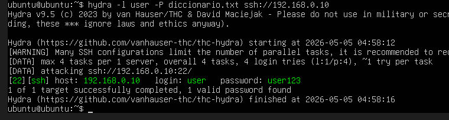
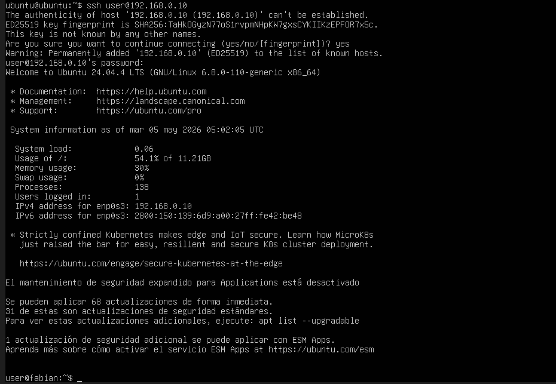
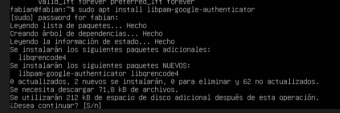
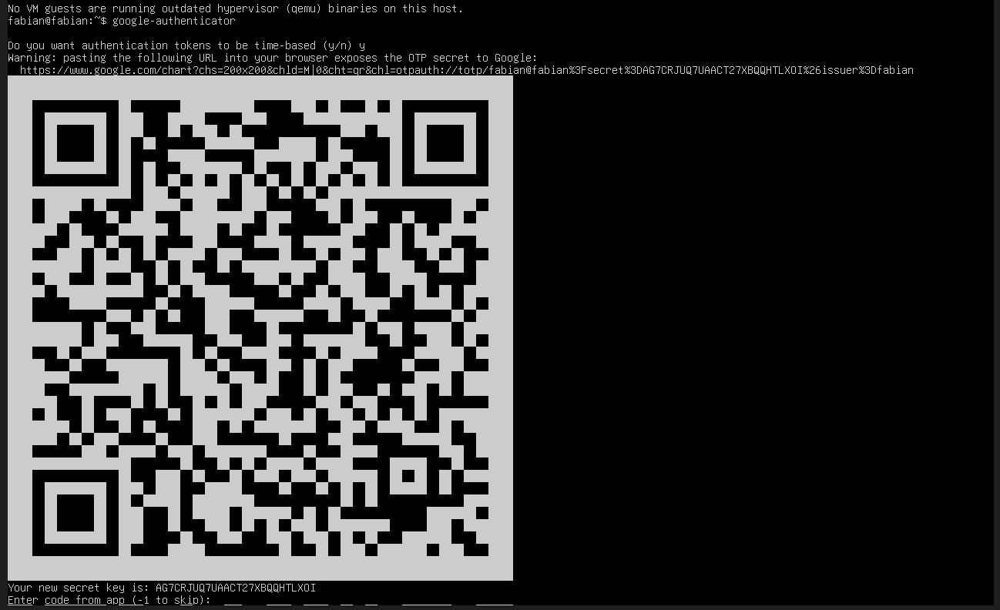
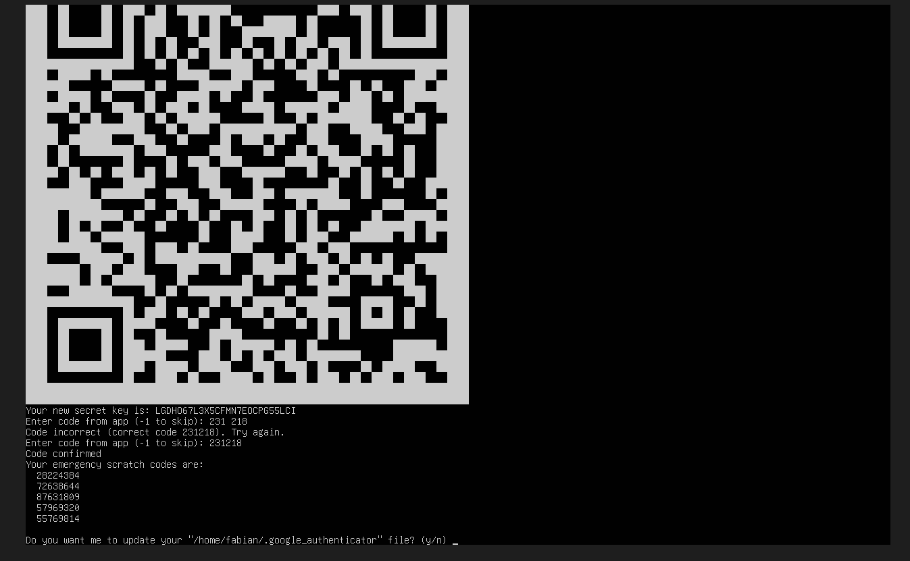
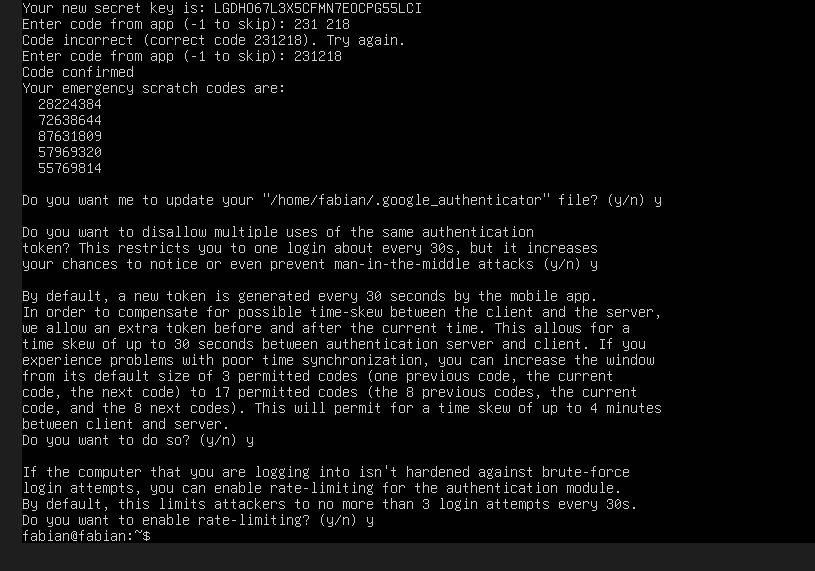
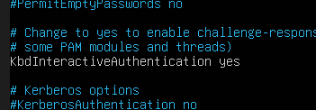
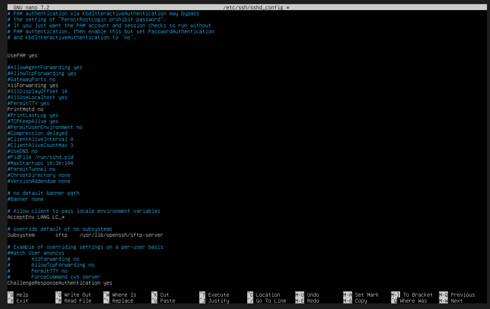
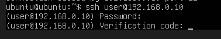
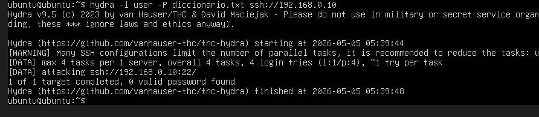

Lab 2: Ataque y Defensa de Credenciales (Habilidad: Gestión de contraseñas)

Actividad: Realizar ataques de diccionario y fuerza bruta, para luego implementar MFA.
Herramientas: Hydra, John the Ripper, Google Authenticator PAM module.
Tarea: Romper una contraseña débil de SSH usando Hydra. 
Luego, instalar y configurar el módulo de Google Authenticator en el servidor Ubuntu para que, aunque el atacante tenga la clave, no pueda entrar sin el token.

Dinámica:
Fase de Ataque: Desde Kali, usar Hydra para realizar un ataque de diccionario contra el servicio SSH del Ubuntu.
hydra -l usuario -P lista_passwords.txt ssh://[IP_Servidor]
Fase de Hardening (MFA): En el Ubuntu Server, instalar el módulo PAM de Google Authenticator.
sudo apt install libpam-google-authenticator
Ejecutar google-authenticator y configurar la App en el celular.
Configuración de SSH: Modificar /etc/pam.d/sshd y /etc/ssh/sshd_config para exigir tanto la contraseña como el token (MFA).
Prueba Final: Volver a intentar el ataque con Hydra. Aunque Hydra encuentre la contraseña, la conexión fallará porque no puede saltarse el segundo factor.

HERRAMIENTAS

Ubuntu server victima

Ubuntu server atacante

Hydra

Google Authenticator

ssh

¿QUE SE HARA?

Se va a realizar un ataque desde una maquina atacante con la herramienta hydra contra el servicio ssh de la maquina victima. Luego del ataque (el cual será exitoso) para mejorar la seguridad de la maquina victima se implementara un MFA con google authenticator. Luego de la implementación se realizara nuevamente el ataque con hydra para verificar los cambios y si el MFA fue configurado con éxito.

¿QUE SE VERA?

-Ejecución de la herramienta hydra con un ataque el cual utiliza un diccionario

-Configuración de ssh

-Configuración e instalación de google authenticator

-Intento de acceso una vez el MFA es activado

FINALIDAD

Este laboratorio se realiza con la finalidad de ver como funcionan los ataques contra servicios como ssh y también para entender la importancia de las herramientas que brindan MFA como segunda capa de seguridad, lo que puede evitar el acceso incluso si la contraseña ha sido descubierta.

DESARROLLO DEL LABORATORIO

Primero se realiza el ataque a la maquina victima con hydra

Como se puede ver el ataque fue exitoso, pues se consiguio la contraseña y el usuario.

Luego de esto para probar las credenciales ingresamos mediante el ssh

Las credenciales y el usuario son autenticos ya que el atacante ingreso.

Luego de esto para reforzar la seguridad en la victima se instala google authenticator

Cuando se instale google authenticator este brinda un qr por lo tanto se lee con el telefono

Una vez leido desde el celular se mostrara un token el cual debe ingresarse

Luego de esto se puede proceder a terminar la configuracion de google authentication

Se continua con la configuracion

Luego se configura el ssh 

Luego de se intentara loggear denuevo desde la maquina atacante y como se podra ver luego de la contraseña pide un codigo

Para finalizar se realiza nuevamente un ataque con hydra y este fallara

