Lab 3: Protocolos de Comunicación Seguros (Habilidad: Tráfico e Intercepción)
Entorno: Kali (Wireshark) y un servidor Apache/Nginx

Actividad: Análisis de tráfico inseguro vs. cifrado.
Herramientas: Wireshark, Certbot (Let's Encrypt), OpenVPN/WireGuard.
Tarea: Capturar una sesión HTTP y ver la contraseña en texto plano. Luego, configurar un certificado SSL (HTTPS) y verificar que el tráfico ahora es ilegible. Configurar un túnel SSH con llaves deshabilitando el acceso por contraseña.

Dinámica:
Sniffing de HTTP: El alumno llena un formulario en una web HTTP mientras corre Wireshark. Verá su usuario y contraseña en texto plano (filtro http.request.method == "POST").

Hardening con SSH Tunneling: Aprender a crear un túnel local para proteger tráfico inseguro.
ssh -L 8080:localhost:80 usuario@servidor

¿QUE SE HARA?

En este laboratorio se levantara una pagina con ubuntu server con apache esta pagina será modificada con un formulario simple el cual usara del método http post. Luego de la configuración de la pagina desde la maquina atacante se entrara, se ingresaran las credenciales y se enviara el formulario. Desde la misma maquina atacante se iniciara wireshark para poder visualizar el trafico y ver si es posible capturar las credenciales en texto plano.

Para evitar esto se creara un túnel ssh el cual deberá ser solo ingresado mediante la clave de una llave la cual será creada en este laboratorio, también, se incorporara y configurara un certificado ssl para obtener https y de esta manera evitar que las credenciales del usuario se vean a través de wireshark en texto plano.

¿QUE SE VERA?

Se podrá ver lo insegura que es una pagina sin certificado ssl debido a la facilidad que hay en el que sea interceptada con herramientas como wireshark.

También vera la configuración y creación de un túnel ssh y el certificado ssl junto con la utilización de la herramienta wireshark.

FINALIDAD

Implementar herramientas y protocolos de protección para lograr una comunicación segura mediante cifrado.

HERRAMIENTAS

-Wireshark

-Apache

-ssl

-ssh

-Kali Linux

-Ubuntu Server

DESARROLLO

Primero instalamos apache en la maquina victima para poder asi levatar la pagina
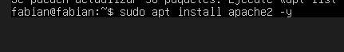

Luego de esto se inicializa apache
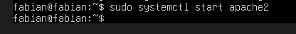

Una vez inicializado se verifica que el servicio este corriendo correctamente en la maquina
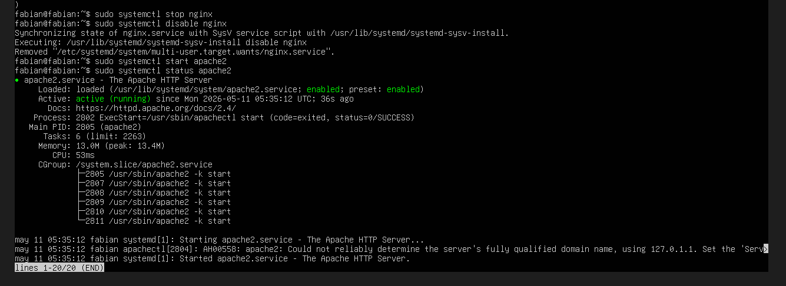

Cuando ya nos hayamos asegurado de que apache este corriendo entramos al archivo index.html para modificarlo

Rellenamos el index html
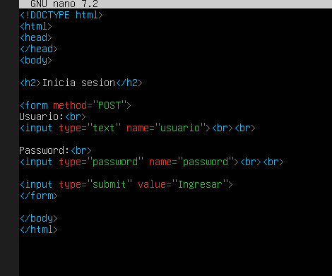

Luego de esto en la maquina atacante iniciamos wireshark y cargamos la pagina
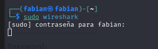

Elegimos la interfaz eth0 ya que es la interfaz que estan usando las maquinas en este momento
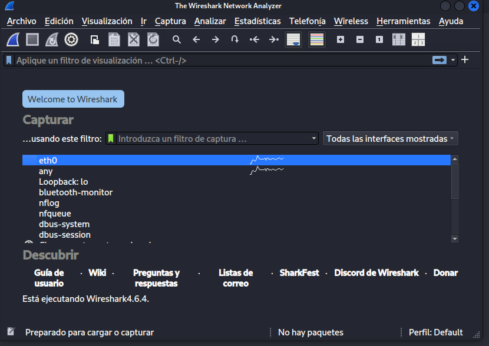

Luego de elegir la interfaz se establece el filtro el cual es http con el metodo post
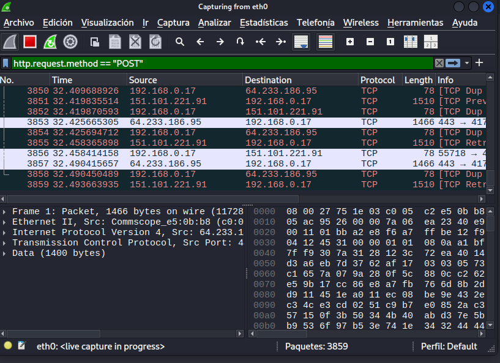

Para comenzar con la intercepcion del trafico se ingresan las credenciales y se apreta el boton para que el navegador utilice el metodo post
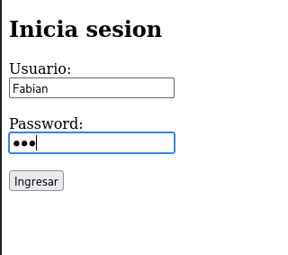

Una vez ingresadas las credenciales y enviado el formulario se ingresa nuevamente a wireshark para revisar si se han interceptado los datos

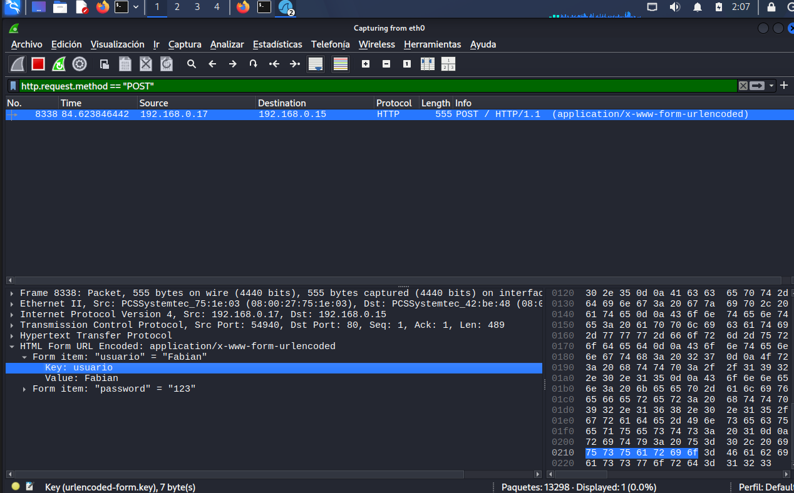

Como se puede ver en la imagen los datos fueron interceptados y las credenciales ingresadas se pueden visualizar en texto plano mediante wireshark

Una forma de evitar de que los datos viajen en texto plano es implementar un tunel ssh

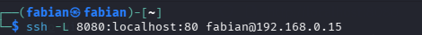

Como se puede ver en el comando se abre un puerto local haciendo que el trafico pase al puerto 80 del servidor.

Luego de esto entramos nuevamente a la pagina utilizando el puerto local 8080 y colocamos nuevamente las credenciales.
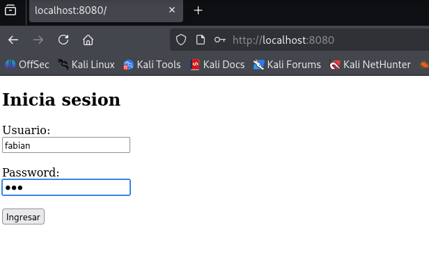

Cuando entramos nuevamente a wireshark, no se detecta nada mediante el metodo http post 
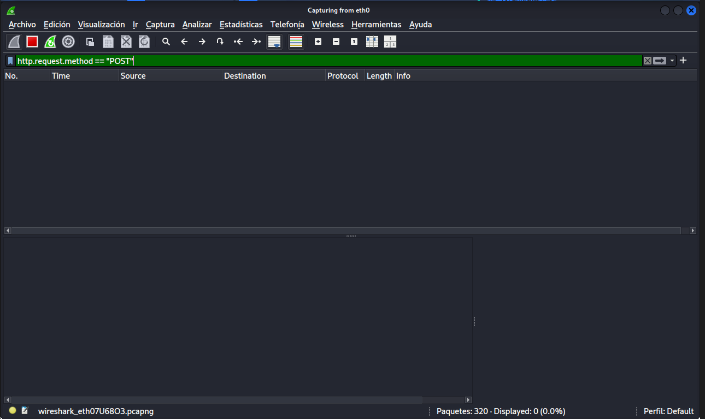

pero si cambiamos el filtro a ssh se puede visualizar desde wireshark las transmisiones que han sido realzadas estas de forma encriptada.
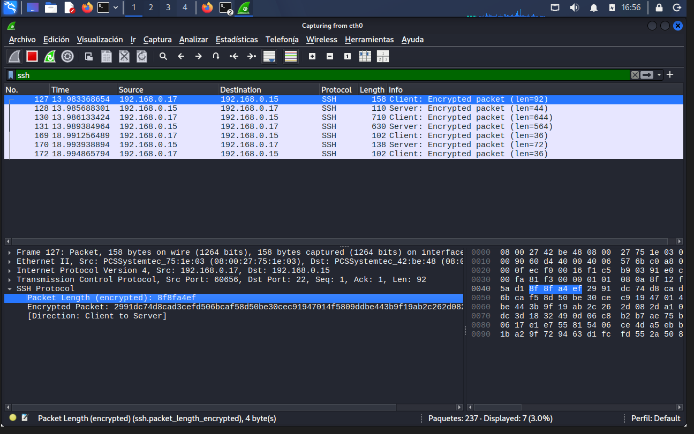
